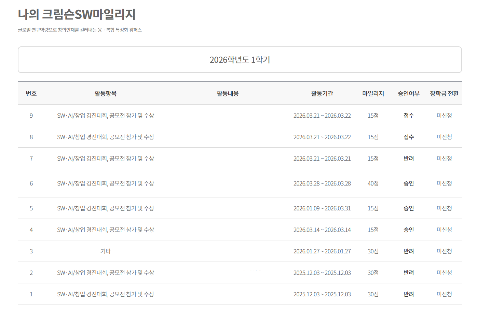
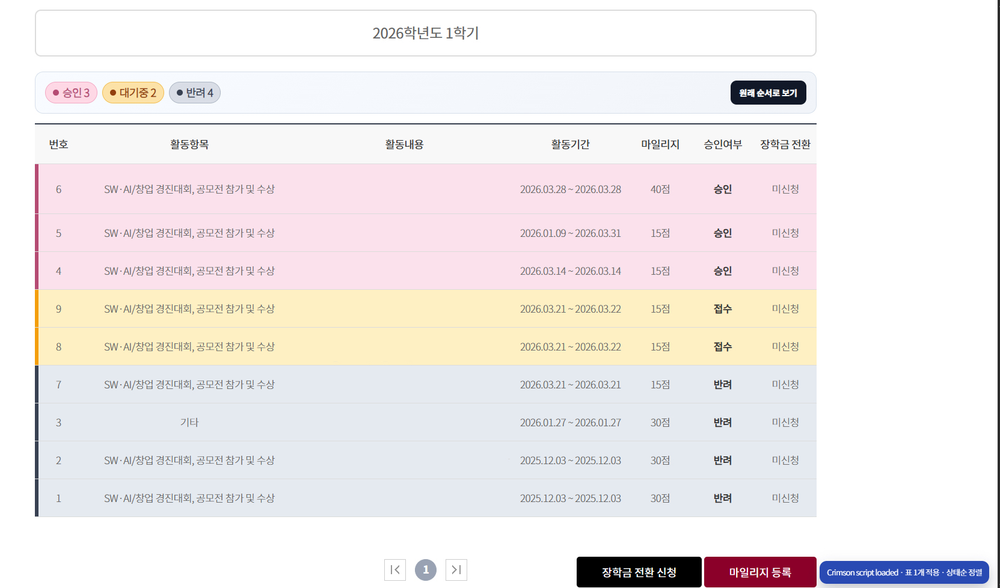

# School Portal Status Table Enhancer

학교 포털의 상태 테이블 가독성을 개선하기 위한 userscript입니다.

포털 화면에서 `승인`, `대기중`, `반려`와 같은 상태값이 단순 텍스트로 표시되는 경우, 항목별 진행 상황을 빠르게 파악하기 어렵습니다. 이 스크립트는 상태별 색상 강조, 배지 표시, 우선순위 정렬, 상단 요약 정보를 추가하여 정보를 보다 직관적으로 확인할 수 있도록 돕습니다.

## 전후 비교

### 적용 전

### 적용 후

## 프로젝트 개요

이 프로젝트는 고려대학교 세종캠퍼스 포털의 Crimson SW 마일리지 페이지를 보다 효율적으로 확인할 수 있도록 제작되었습니다.

상태 테이블을 반복적으로 확인하는 과정에서는 다음과 같은 어려움이 발생할 수 있습니다.

- 승인 여부가 한눈에 구분되지 않음
- 대기중, 반려, 승인 상태를 빠르게 식별하기 어려움
- 상태 기준으로 정렬되어 있지 않아 확인에 추가 시간이 소요됨

본 스크립트는 서버 설정이나 백엔드 로직을 변경하지 않고, 브라우저에서 표시되는 화면만 개선하는 방식으로 이러한 불편을 보완합니다.

## 주요 기능

- 상태값에 따라 행 전체를 색상으로 구분
- 상태 텍스트를 배지 형태로 표시하여 가독성 향상
- 승인, 대기중, 반려 순서로 자동 정렬
- 상단에 상태별 개수 요약 표시
- 버튼을 통해 원래 순서로 복원 가능

## 적용 대상

현재 버전은 고려대학교 세종캠퍼스 포털 내 Crimson SW 마일리지 관련 페이지에 맞춰져 있습니다.

구현은 실제 사용 환경을 기준으로 작성되었지만, 유사한 구조의 다른 학교 포털 테이블 페이지에도 응용할 수 있습니다.

## 설치 방법

1. `Tampermonkey` 또는 `Violentmonkey`를 설치합니다.
2. [school-portal-status-table-enhancer.user.js](./school-portal-status-table-enhancer.user.js) 파일을 엽니다.
3. userscript 관리자에서 스크립트를 설치합니다.
4. 대상 페이지를 새로고침합니다.

Chrome 또는 Edge에서는 확장 프로그램 설정에서 `Allow User Scripts` 또는 개발자 모드를 활성화해야 할 수 있습니다.

## 파일 구성

- [school-portal-status-table-enhancer.user.js](./school-portal-status-table-enhancer.user.js)
- [before.png](./before.png)
- [after.jpg](./after.jpg)
- [LICENSE](./LICENSE)

## 참고

- 이 스크립트는 브라우저의 화면 표시만 변경합니다.
- 외부 서버로 데이터를 전송하거나 별도로 저장하지 않습니다.

## License

MIT
